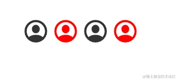
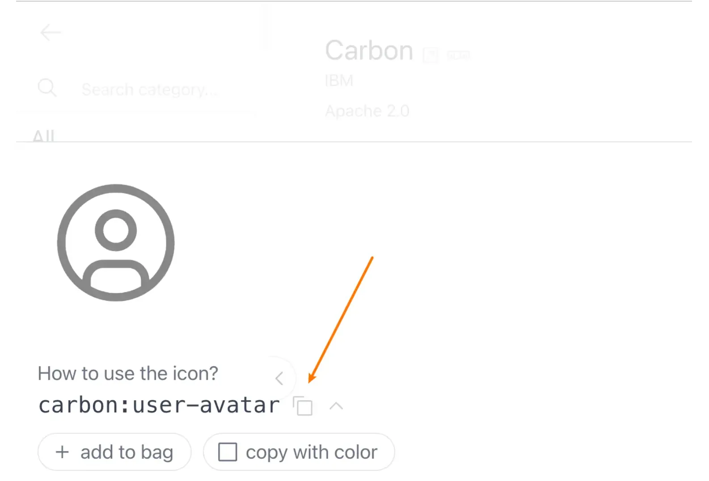

# 图标篇

本文主要介绍了 `图标` 的使用方式，通常有以下几种方式使用图标：

- `UI 库 Icons`
- `UnoCSS Icons`
- `iconfont`

下面笔者一一介绍

## UI 库 Icons

如果您已经引入了 `UI库`，并且正好该 `UI库` 已经有你想要的 `Icons`，那直接用最方便了，无需额外引入其他库，代码也是最少的。

这里介绍几个常用 `UI库` 的图标使用。

### `uni-ui Icons`

> 注意：`uni-ui Icons` 颜色只能通过 `color` 属性设置；使用 `UnoCSS` 设置无效。

```html
<uni-icons type="contact" size="30"></uni-icons>
<uni-icons type="contact" size="30" color="red"></uni-icons>
<uni-icons type="contact" size="30" class="text-green"></uni-icons>
<uni-icons type="contact" size="30" color="red" class="text-green"></uni-icons>
```



### `wot-ui Icons`

> 注意：`wot-ui icons` 颜色可以通过 `color` 属性设置，也可以通过 `UnoCSS` 设置；同时设置时，`color` 属性优先级高。

```html
<wd-icon name="add-circle"></wd-icon>
<wd-icon name="add-circle" color="red"></wd-icon>
<wd-icon name="add-circle" class="text-green"></wd-icon>
<wd-icon name="add-circle" class="text-green" color="red"></wd-icon>
```


### `uv-ui Icons`

> 注意：跟 `uni-ui Icons` 一样，`uv-ui Icons` 的颜色只能通过 `color` 属性设置；使用 `UnoCSS` 设置无效。

```html
<uv-icon name="home"></uv-icon>
<uv-icon name="home" color="red"></uv-icon>
<uv-icon name="home" class="text-green"></uv-icon>
<uv-icon name="home" color="red" class="text-green"></uv-icon>
```


> 注意，经过检测这 `3个UI库Icons` 都不支持使用 `UnoCSS` 改变大小（优先级低被覆盖），必须使用 `size` 属性来设置大小才有效果（行内样式优先于 css 样式）。
>
> 另外，经过检测，都支持动态 `iconName`和动态 `color` ! 即下面这样的写法是生效的：

```ts
const iconName = ref<string>('contact')
const colorName = ref<string>('red')
onLoad(() => {
  setTimeout(() => {
    iconName.value = 'chat'
    colorName.value = 'green'
  }, 1000)
})
```

```html
<uni-icons :type="iconName" :color="colorName" class="text-green w-8"></uni-icons>
<!-- 其他2个UI库同样生效 -->
```

## `UnoCSS Icons`

`UnoCSS Icons` 可以方便接入 `iconify` 图标库，后者拥有 `10万+` 的海量图标，总能找到你想要的。

### 1. 安装 iconify

在使用 `iconify` 之前需要安装对应的图标库，安装格式如下：

`pnpm i -D @iconify-json/[the-collection-you-want]`

以安装 `carbon` 为例，执行 `pnpm i -D @iconify-json/carbon` 即可。

> `unibest` 已经装好了 `carbon` 图标库，可以直接使用。

### 2. 找到 iconify 想要的图标名

打开网址：<https://icones.js.org/>

- 在里面找到某个库，如 `carbon`。


- 搜索想要的图表，如 `avatar`，出现的搜索结果，查看类名，也可以点击图标，会出现详情（ `details` 里面）。




- 如上图（ `details` 里面），拿到 `carbon:user-avatar`。

### 3. 编写代码

- 代码里面 `class` 填写 `i-carbon-user-avatar`（所有的单词用中划线连接即可）并且支持改颜色。

```html
<view class="i-carbon-user-avatar text-red" />
```


> 如果图标没有预览效果，请安装 `VSCode` 插件 `antfu.iconify`。

预览效果：


### 4. 动态图标名

昨天有网友反馈，`UnoCSS Icons` 无法使用动态类名，我来试试：（我先说结论：是支持的！）

```ts
const iconName = ref<string>('i-carbon-car')
onLoad(() => {
  setTimeout(() => {
    iconName.value = 'i-carbon-user-avatar'
  }, 1000)
})
```

```html
<view :class="iconName" />
```

一秒后会由 `i-carbon-car`（一辆车） 变成 `i-carbon-user-avatar`（一个头像），一切都是 OK 的。

> 但是注意，跨文件的话动态图标名不能生效。

## iconfont 图标库

`iconfont` 同样有海量免费的图标，同时支持上传自己的图标。公司项目通常会有自己的图标，由专业的 `UI设计师` 设计，这时通常会使用 `iconfont` 方式使用图标。

- 1. 打开`阿里巴巴矢量图标库 iconfont`，地址：[https://www.iconfont.cn/](https://www.iconfont.cn/)，并登录。
- 2. 寻找需要的图标，加入项目，也可以上传自己的图标。
- 3. 图标方式选择 `Font class`，`项目设置` 勾选上 `base64`，否则`非H5端` 不支持，然后点击生成链接。


- 4. 把上面的 `css` 链接里面的内容写入在 `style/iconfont.css`，并引入到 `style/index.scss`。
- 5. 页面上直接写 `<i class="iconfont icon-package text-red"></i>` 即可！

```html
<view class="m-4">
  <text mr-2>iconfont:</text>
  <i class="iconfont icon-package text-red"></i>
  <i class="iconfont icon-chat text-red"></i>
  <i class="iconfont icon-my text-red"></i>
</view>
```

预览如下：


> 上面的选择有疑问的可以看详细版 - [iconfont 详细版](/other/iconfont/iconfont)

## 其它图标库

其他优秀的可以免费商用的图标库：

- 字节跳动的 `IconPark`，链接 [https://iconpark.oceanengine.com](https://iconpark.oceanengine.com/)。
- 不知道谁家的 `yesicon`，链接 [https://yesicon.app](https://yesicon.app/)。

## 总结

本文介绍了 `3` 种使用图标的方式，分别是 `UI 库 Icons`、`UnoCSS Icons`、`iconfont`。

- `UI 库 Icons` 颜色和大小属性都主要由 `UI 库` 本身控制，且都支持动态图标名和动态颜色。

- `UnoCSS Icons` 最省心，强烈推荐使用。

- `iconfont` 需要勾选 `Base64` 才能兼容多端。

全文完~
